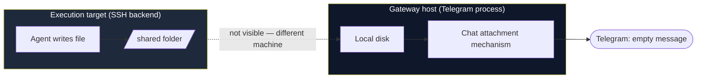
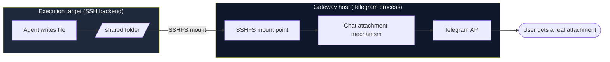

## Situation

I run an AI agent (Hermes) that talks to me over Telegram and does real work through terminal and file tools: writes files, runs commands, generates reports and screenshots. To keep that execution off the small box that hosts the chat gateway itself, the agent's `terminal.backend` is configured as `ssh`, pointing at a separate, beefier machine — my Mac mini.

Everything worked, until I asked for a file back. The agent wrote a Markdown report, told me it was sending it, and Telegram showed... nothing. Empty message, no attachment, no error I could act on.

## Task

I needed the agent to reliably hand me files it generates — reports, screenshots, whatever — as native chat attachments, not as a link I have to click through every time. And I wanted it to keep working without me babysitting it every session.

## Action

### Finding the actual gap

The agent's chat-attachment mechanism (`MEDIA:/path/to/file`) only resolves files sitting on the **gateway host's own disk** — the machine running the Telegram-facing process. Nothing on the SSH execution target is visible to it, because from the gateway's point of view, it's a completely different filesystem on a completely different machine.

So the file existed. It was real. It just existed in the wrong place.



### The workarounds I ruled out

**Fetching the file from the gateway host.** Doesn't work when the execution target sits behind a home router with no public route back — the gateway simply can't reach in.

**Public temp-file hosting.** Mechanically fine, but every file briefly sits on a third party's server with no auth. Not something I wanted as my default path for arbitrary generated content.

**A self-hosted upload relay.** I actually built one first — a small Sinatra service, bearer-token auth, single-use download link, 15-minute TTL. It worked, and it's still sitting in my infrastructure as a fallback. But it meant every delivery needed an explicit upload call, a URL round-trip, and the agent manually pasting a link into chat. That's ceremony I didn't want per file.

### The fix: mount the execution target into the gateway host

The agent's SSH backend already has a trusted, working connection to the execution target — that's how it runs commands there in the first place. I used that same trust in reverse: **mount a folder from the execution target onto the gateway host via SSHFS.**

Once mounted, any file the agent writes into that shared folder on the execution target shows up **instantly** as an ordinary local file on the gateway host. No upload, no token, no TTL. The chat-attachment mechanism just sees a local path, because as far as its process is concerned, that's exactly what it is.



### Setting it up

A few things bit me on the way to a working mount, worth knowing before you try this yourself:

**Reuse the trust that already exists.** I almost generated a brand-new SSH keypair for the gateway-to-target direction before checking whether one already worked. It did — the same key the agent's SSH backend uses to run commands on the target. Reusing it meant one less credential to manage and rotate.

**Check who's actually allowed to log in.** The target's `sshd_config` had `PermitRootLogin yes`, but also `AllowUsers <specific-user>`. Connecting as root failed with a generic `Permission denied (publickey)` that looked like a key problem. It wasn't — it was a username allowlist silently rejecting a user that was never going to be let in regardless of the key.

**Make the mount a systemd service, not a one-off command.** A raw `sshfs` invocation dies the moment the SSH connection blips, and it definitely doesn't come back after a reboot. Wrap it:

```ini
[Unit]
Description=SSHFS mount of execution-target shared folder
After=network-online.target
Wants=network-online.target

[Service]
Type=simple
ExecStartPre=-/bin/fusermount -u /mnt/target-shared
ExecStart=/usr/bin/sshfs -f -o IdentityFile=/root/.ssh/id_ed25519,StrictHostKeyChecking=accept-new,reconnect,ServerAliveInterval=15,ServerAliveCountMax=3,allow_other <user>@<target-host>:/home/<user>/agent-shared /mnt/target-shared
ExecStop=/bin/fusermount -u /mnt/target-shared
Restart=always
RestartSec=10

[Install]
WantedBy=multi-user.target
```

`Restart=always` plus `reconnect` in the `sshfs` options means a dropped connection comes back on its own. `WantedBy=multi-user.target` means it survives a reboot without me touching it.

**Actually test the failure mode, not just the happy path.** I `pkill`'d the `sshfs` process directly mid-session to confirm systemd would respawn it and the mount would reappear. It did, in about ten seconds. That's the difference between "worked once when I set it up" and "will still work at 3am when the network hiccups."

## Result

Files the agent generates on the execution target now land as real Telegram attachments the moment they're written — no relay, no manual link, no per-file ceremony. I write a file into the shared folder on one machine, and it just appears, correctly, on the other.

The relay I built first didn't go to waste — it's still there as a documented fallback for any execution target that doesn't have this bridge set up, or for the (hopefully rare) day the mount itself goes down. But it's no longer in the critical path, and that's the part I actually wanted: one less thing to think about every time the agent needs to hand me something.

If you're running an AI agent (or any automation) with its execution split across two machines, this pattern generalizes past chat bots — anywhere one process needs to treat another machine's files as if they were local, SSHFS plus a systemd unit is a lot less code than it sounds like, and a lot more reliable than remembering to upload something every time.
